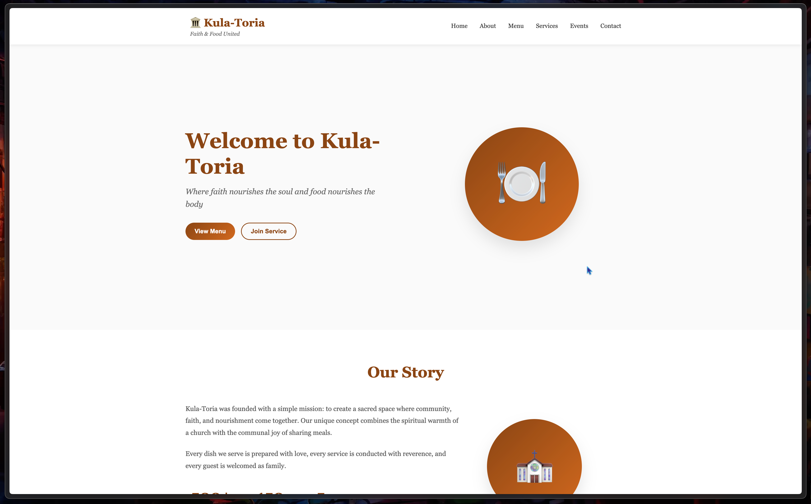

# Kula Toria



This is a learning draft representation of the restaurant located in East Assembly KAG.

## Table of contents

1. [Technologies](#Technologies)
2. [Structure](#Structure)
3. [Contributors](#Contributors)

### Technologies

- Javascript
- CSS

### Structure

This contains a static page presentation of kula toria.

This the current folder structure:

```plaintext    
<working-directory>
├── index.html              # the static html file
├── README.md               # Project documentation
├── CODE_OF_CONDUCT.md      # Code of conduct specification
├── LICENSE                 # Apache Licence
├── CONTRIBUTING.md         # Contributing guidelines
├── .pre-commit-config.yaml # Pre commit configuration
├──src/
|   ├── styles/             # stylesheet folder
|   |   ├── styles.css      # css stylesheet file 
|   ├── scripts/            # javascript folder
|   |   ├── index.js        # javascript file 
```


### Contributors

In order to do contributions, you need to follow the contribution guidelines [here](CONTRIBUTING.md)
- [iberniex](https://github.com/iberniex)
- [iberniex](https://github.com/iberniex)

<!-- add your username here -->
